# FingerEye 0.1
**Нажмите на изображения ниже для получения дополнительной информации**

## Быстрый старт
Пожалуйста, следуйте [Hardware Quick Start Guide](https://github.com/mcubelab/gelslim/blob/main/Hardware/GelSlim%20Hardware%20Quick%20Start%20Tutorial.pdf) инструкции по сборке собственного датчика. Приведенные ниже пошаговые ресурсы находятся в процессе обновления.

## Пошаговая инструкция
| 3D печать  | PCB gпроизводство | Производство эластомера | Сборка |
|---|---|---|---|
| <a href="  ">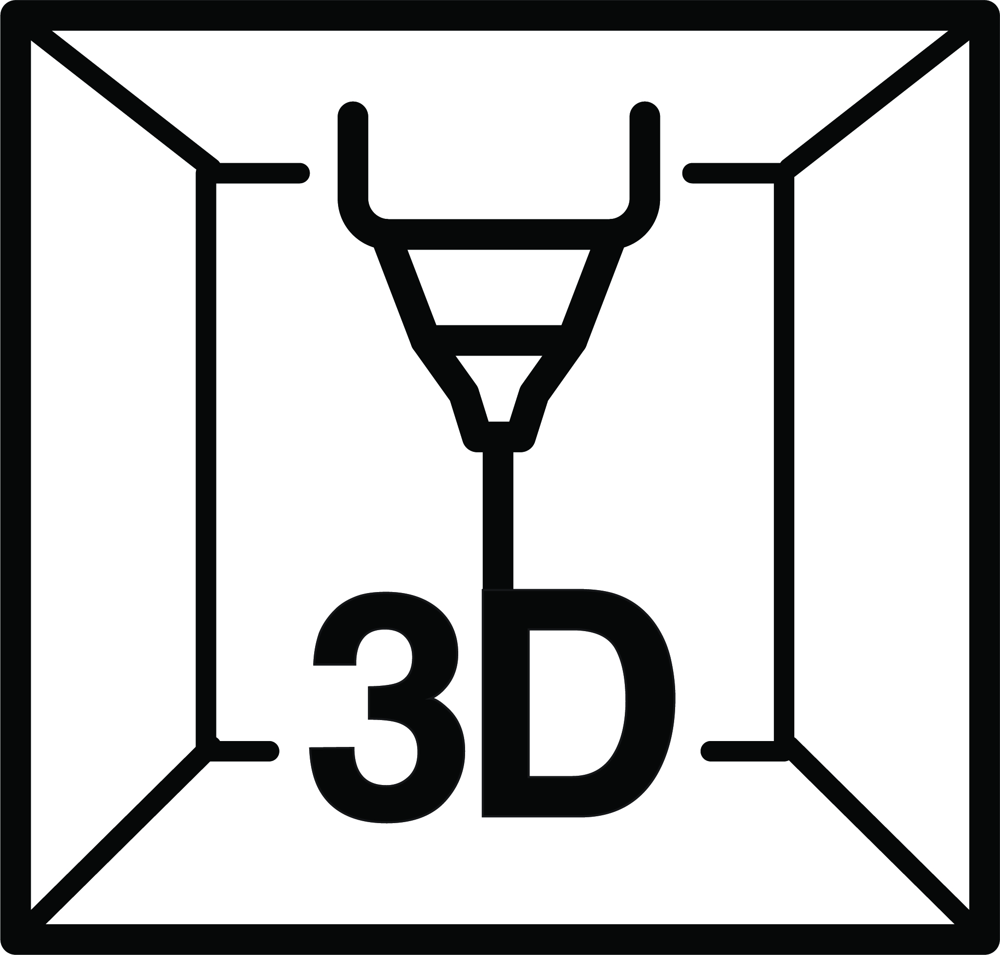</a>| <a href="  ">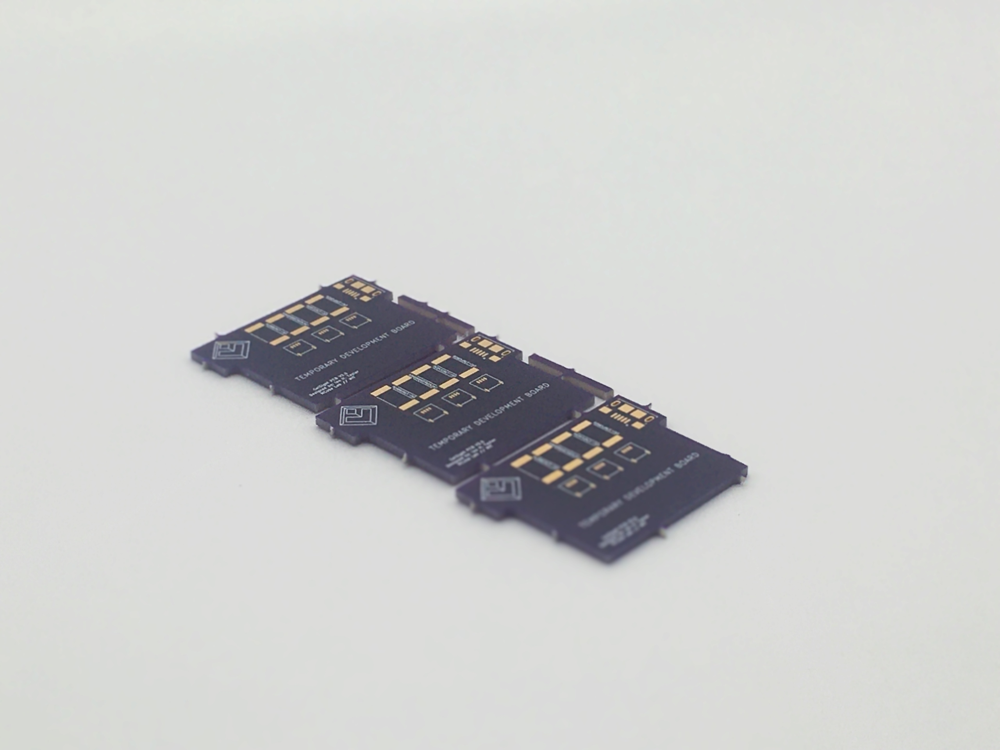</a>| <a href="  ">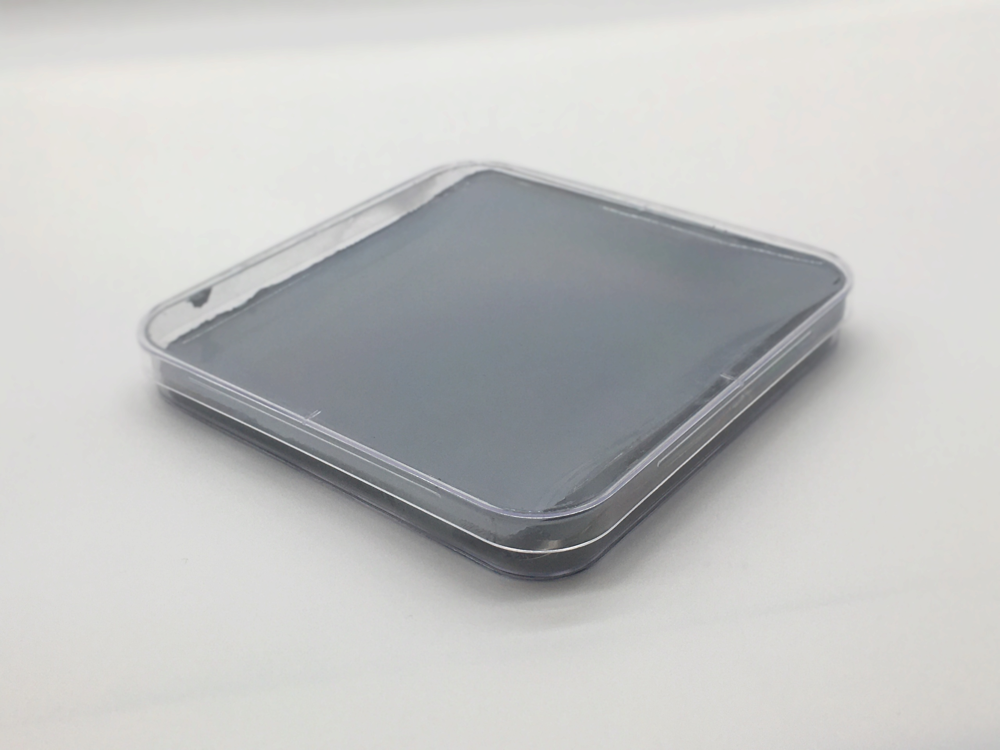</a>| <a href="  ">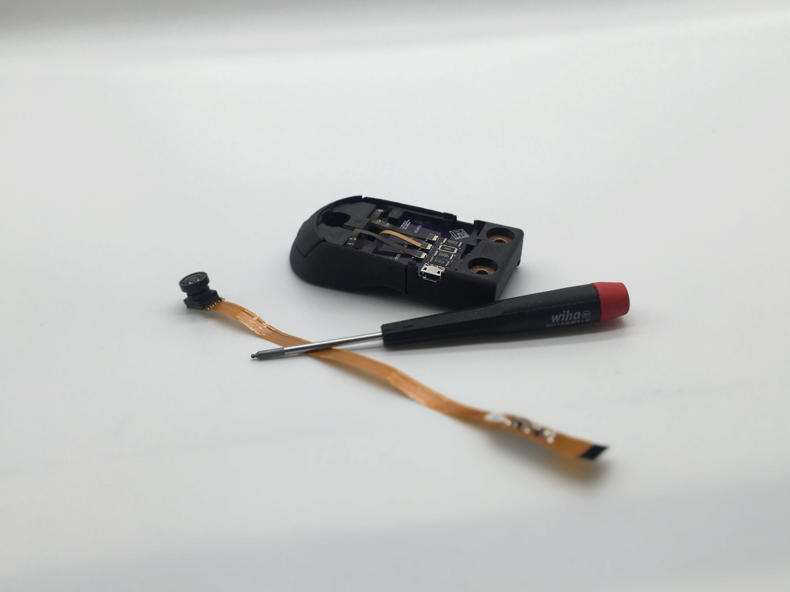</a>| 

## Механика
| Эластомер | Крепеж | Корпус | Оптическая линза |
|---|---|---|---|
| <a href="Hardware/Mechanical/Elastomer">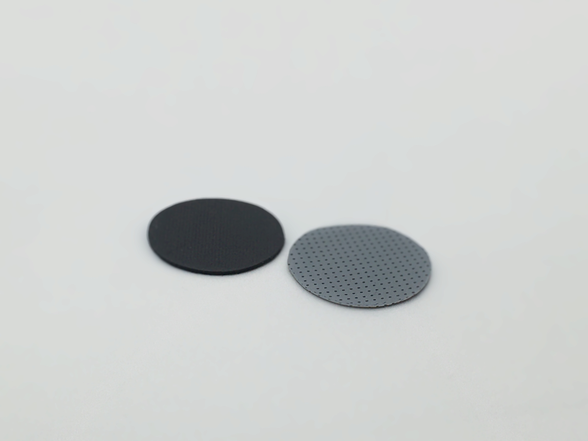</a>| <a href="  ">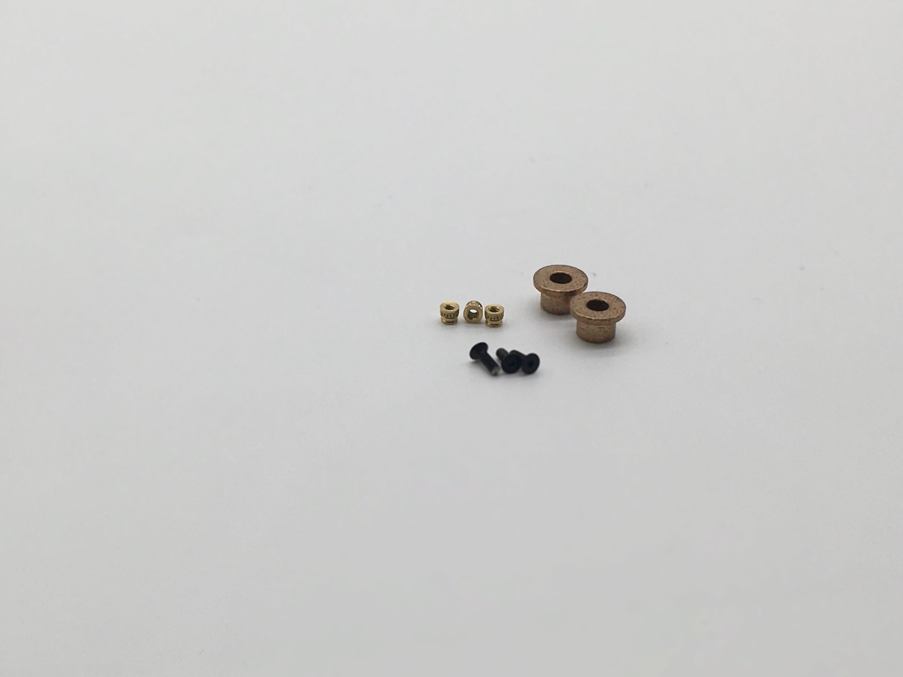</a>| <a href="  ">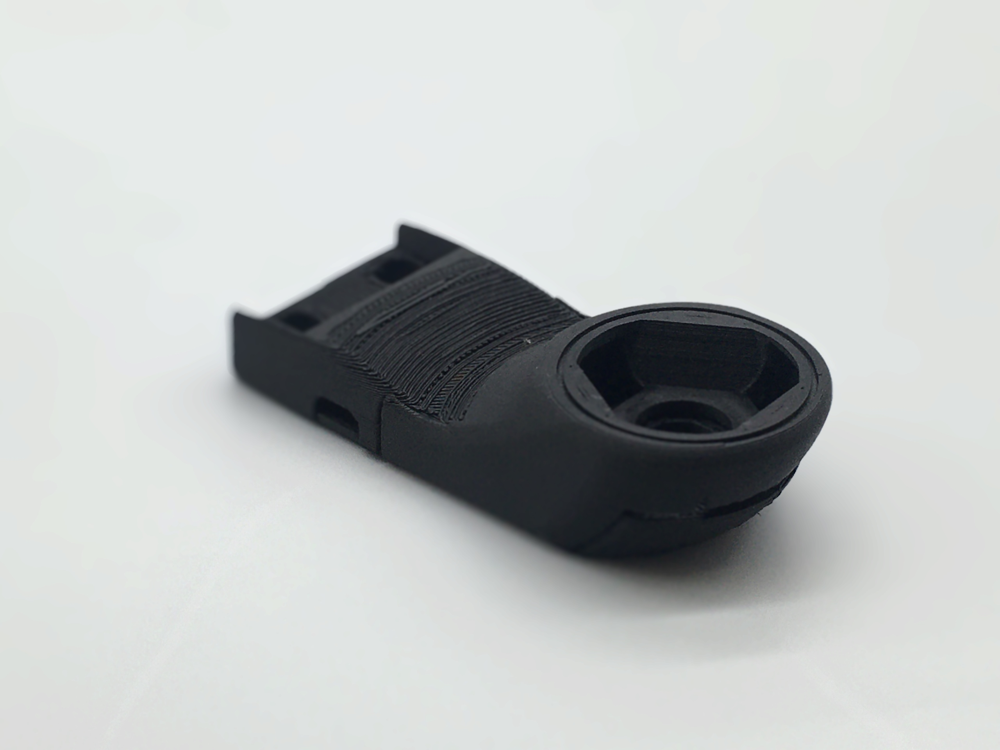</a>| <a href="  ">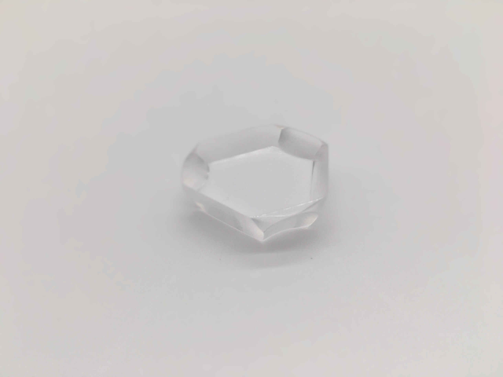</a>| 

## Электрика
| LED драйвер | LED сборка | Камера | Коннекторы и адаптерs |
|---|---|---|---|
| <a href="  ">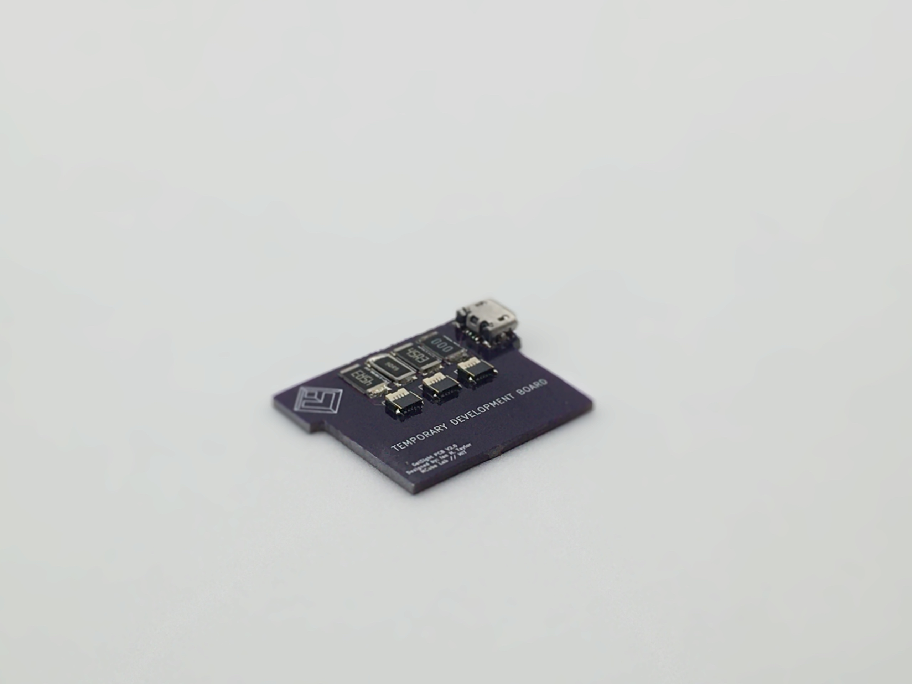</a>| <a href="  ">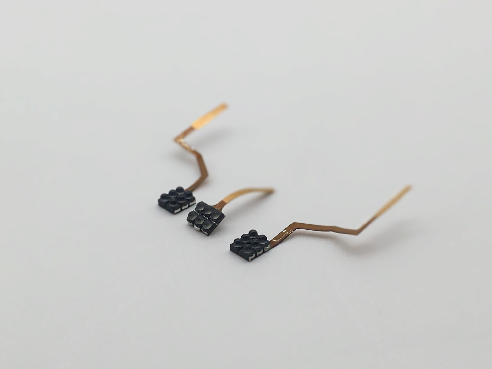</a>| <a href="  ">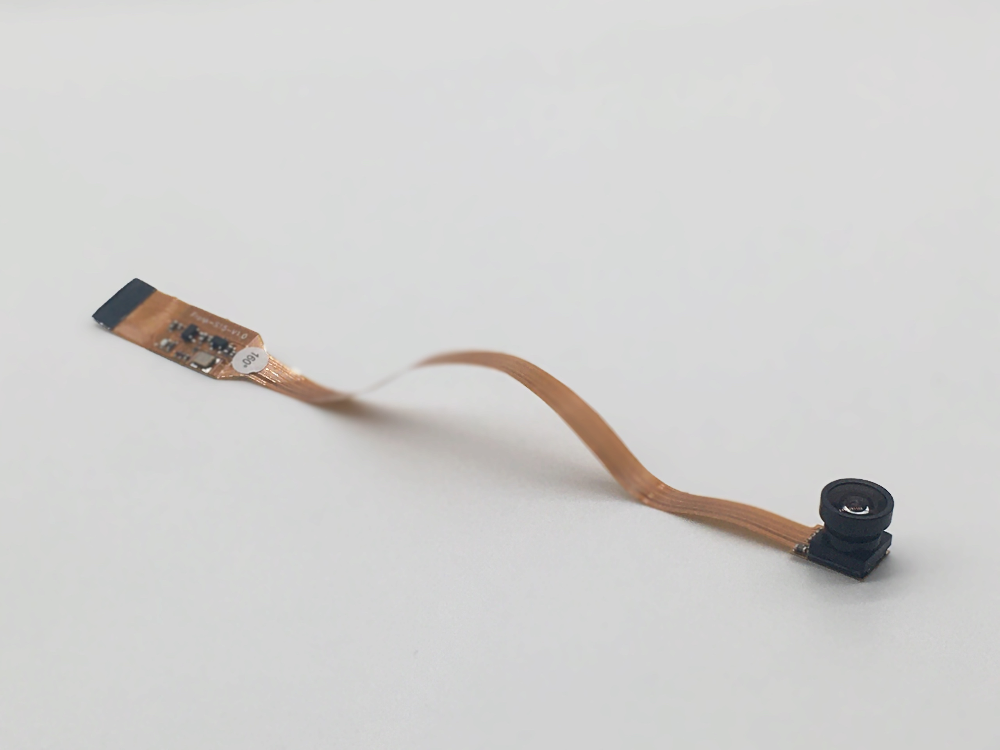</a>| <a href="  ">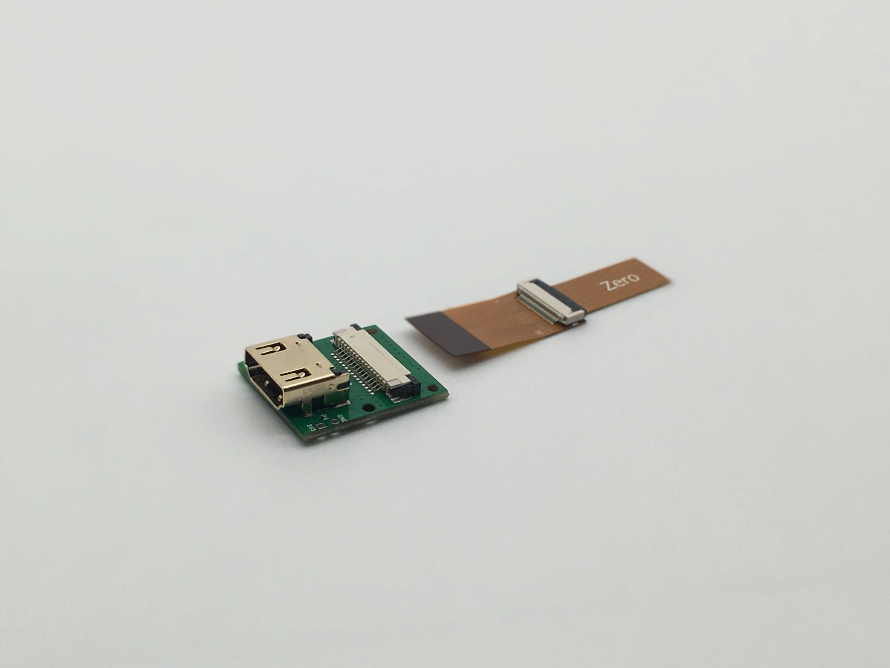</a>| 

## Программное обеспечение
| Raspberry Pi | Зависимости | GUI | Калибровка |
|---|---|---|---|
| | | | | 

## Подробнее
| Механические инструменты и расходные материалы | EЭлектронные компоненты и инструменты | Известные вопросы | Содействие |
|---|---|---|---|
| | | | |

## Дополнительная информация
[GelSlim 3.0 - Webpage](https://ianhtaylor.net/gelslim-30) 
[GelSlim 3.0 - Paper](https://arxiv.org/abs/2103.12269) 
[GelSlim 3.0 - Demo](https://www.youtube.com/watch?v=Y10XN9byO0g) 
[MCube Lab - YouTube Channel](https://www.youtube.com/channel/UCMYUWZTFWZjj7pUc3UPUjig)     

## Заметки
Этот репозиторий находится в стадии разработки, следующих файлов и папок нет.
- Image links to and README documentation for root sub-folders
	- Step-by-step Instructions
	- Mechanical
	- Electrical
	- Software
	- More Details
- /Simulation and Optimization/Results
- /Simulation and Optimization/Settings
- /Software/GUI 
  - Tangential Force Calculation
  - Normal Force Calculation

## Вопросы

## Авторы

## Лицензия
Эти файлы проекта лицензируются по лицензии CC-by-NC, как указано в [LICENSE](https://github.com/mcubelab/gelslim/blob/main/LICENSE) file.
